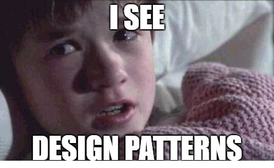

title: Design Patterns
class: animation-fade
layout: true

.bottom-bar[

{{title}}

]

---

class: impact

# {{title}}

## Un catálogo nada exhaustivo

> "Orienta tu código para un uso futuro,

> no solo para las necesidades inmediatas."
>
> -- **Eric Freeman**

---

## Principios para un final feliz

###  POLA: Principle Of Least Astonishment.

- No me sorprendas, no me hagas pensar.

###  YAGNI: You aren't gonna need it.

- Implementa cosas cuando las necesites, no cuando preveas que las necesitas.

### HP: Hollywood principle.

- No nos llames, ya te llamaremos. Inversión del control.

### TDA: Tell don’t ask.

- Decirle a los objetos lo que quieres que hagan (método con datos propios), no consultarles para actuar con sus datos después.

---

### CQS: Command–query separation.

- Cada método debe ser o un comando que realice una acción o una consulta que devuelva datos; **pero no ambos**.

### CoC: Convention over configuration.

- Establecer y cumplir convenios que minimicen la cantidad de decisiones necesarias.

### La Ley de Demeter (LoD)

- Un objeto debe asumir lo menos posible acerca de cualquier otro. _Antiglobalización!_.

### Composite reuse principle

- Mejor componer que heredar.

---



> Evoluciona en función del tiempo de mantenimiento esperado.
>
> -- **Alguien con experiencia**

---

## Creacionales

> ¿Cómo instanciar un objeto o grupo de objetos relacionados?

Proporcionan mecanismos de creación de objetos que aumentan la flexibilidad y la reutilización del código existente.

- Abstract Factory
- **Builder**
- **Factory Method**
- Prototype
- Simple Factory
- Singleton

---

## Estructurales

> ¿Cómo construir un componente a partir de objetos?

Explican cómo ensamblar objetos y clases en estructuras más grandes, manteniendo las estructuras flexibles y eficientes.

- Adapter
- **Bridge**
- Composite
- Decorator
- **Façade**
- Flyweight
- Proxy

---


## De comportamiento

> ¿Cómo ejecutar una funcionalidad entre varios objetos?

Cuidan la comunicación efectiva y la asignación de responsabilidades entre objetos.

- Chain of Responsibility
- **Command**
- Iterator
- Mediator
- Memento
- Observer
- Visitor
- **Strategy**
- State
- Template Method

---

## Creational

### Builder

```typescript
export class ShoppingCartManager {
  constructor( client: Client ) {
    this.shoppingCartBuilder = new ShoppingCartBuilder( client );
    this.shoppingCart = this.shoppingCartBuilder.build();
  }
  public calculateCheckOut( checkOut: CheckOut ) {
    this.shoppingCartBuilder.setCheckOut( checkOut );
  }
}
```

---

### Factory Method

```typescript
interface ITemplateManager {
  getTemplate( shoppingCart: ShoppingCart ): string;
  getMessage( content: string ): string;
}
class InvoiceTemplateManager implements ITemplateManager{}
class OrderTemplateTemplateManager implements ITemplateManager{}

class DocumentManager {
  protected  templateManager: ITemplateManager;
  constructor() { this.setTemplateManager(); }
  protected setTemplateManager(): ITemplateManager
}
```

---

```typescript
class InvoiceManager extends DocumentManager{
  protected setTemplateManager(): InvoiceTemplateManager {
    this.templateManager = new InvoiceTemplateManager();
  }
}
class OrderManager extends DocumentManager{
  protected setTemplateManager(): OrderTemplateTemplateManager {
    this.templateManager = new OrderTemplateManager();
  }
}

class ShoppingCartManager{
  public send(){
    new InvoiceManager().send(this.shoppingCart);
    new OrderManager().send(this.shoppingCart);
  }
}
```
---

## Structural

### [Bridge](https://refactoring.guru/design-patterns/bridge/typescript/example#lang-features)
- file manager
### [Façade](https://refactoring.guru/design-patterns/facade/typescript/example#lang-features)
- simplificar el trabajo con ficheros

---

## Behavioral

### [Command](https://refactoring.guru/design-patterns/command/typescript/example#lang-features)
- procesado de pedidos

### [Strategy](https://refactoring.guru/design-patterns/strategy/typescript/example#lang-features)
- Usar el TaxCalculator para líneas o para totales

---

# Arquitecturas para construir software de tamaño medio

>Entre **1 o 2 años** de tiempo de desarrollo y mantenimiento evolutivo activo, con equipos estables de entre **2 - 4 integrantes**.

**Ejemplos**:
- Producto en marcha en una start-up en crecimiento.
- Aplicaciones departamentales o para pequeñas empresas.
- Aplicaciones web sobre plataformas standard.
- Otros desarrollos técnica y funcionalmente poco complejos.

---

**Situación**:

- Los tiempos y presupuestos permiten **dedicar recursos al diseño técnico** del desarrollo.

- Los **cambios funcionales serán menos frecuentes pero potencialmente más graves**, pues el software estará en uso.

- La reducción del **coste de explotación** está en la reducción de _bugs_ y mantenimiento.

**Objetivo**:

>Facilitar el cambio funcional mediante _Design Patterns_, pero con un código localizable con _3 simple layers_.

---

## Reglas:

**Código**: Evitar más _code smells_ mediante patrones de diseño que lleven a un código fácil de ampliar.

**Mantra**: Reparto de responsabilidades entre clases.

**Test**: Garantizar que el software admite los cambios mediante pruebas de integración sencillas.

**Componentes**: Separar el código en capas lógicas (packages, namespaces, modules… según el lenguaje). Ej.: `presentación -> lógica -> persistencia`.

**Despliegue**: Mantener mientras sea posible un despliegue sencillo, tendente al monolito en cada capa física. Ej. : `cliente <—> servidor`

---

- [<- Vuelta al índice ](./)

- [Repo](https://github.com/AcademiaBinaria/clean-software-architecture)
