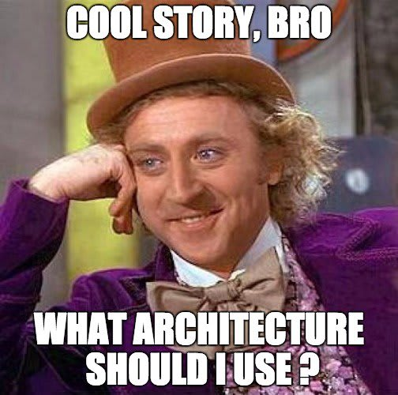

title: Onion Architecture
class: animation-fade
layout: true

.bottom-bar[

{{title}}

]

---

class: impact

# {{title}}

## Arquitectura en capas

---

# Arquitecturas para construir software de tamaño extra grande.

> Entre **8 y 16 años** de tiempo de desarrollo y mantenimiento evolutivo activo.
>
> Equipos variables de **16 o más integrantes**.

**Ejemplos**:

- Software de gestión de grandes corporaciones, bancos y administraciones públicas.
- Continuidad de productos o servicios online de gran éxito.

---

## Situación:

- Más allá de 8 años ya sólo una cosa será cierta; **todo habrá cambiado**.

- Además del negocio también cambiarán **las tecnologías, las personas, y las demandas y expectativas** de los usuarios.

- Así que, si algo va a durar una década, mejor que **no dependa de pequeños detalles** sin importancia como las bases de datos, las interfaces de usuario, los protocolos de comunicaciones, los frameworks o los dispositivos físicos de última generación :-).

## Objetivo:

> El **desacoplamiento extremo** entre el núcleo del negocio y los detalles técnicos. Inversión del control para que las reglas de negocio no dependan de otras capas.

---

## Reglas:

**Mantra**: _Que el negocio no dependa de la tecnología._

**Código**: Aplicar técnicas de inyección de dependencias para invertir el control.

**Test**: Garantizar que el software funciona unitariamente mediante pruebas a nivel de paquete desplegable.

**Componentes**: Reducir las dependencias de la lógica de negocio a los básicos del lenguaje.

**Despliegue**: Propiciar el despliegue de servicios (o micro-servicios) y aplicaciones (o micro-aplicaciones) al menor nivel posible. Las arquitecturas más usadas son **la hexagonal y la circular o cebolla** con las entidades del dominio y las reglas en el centro o cúspide del árbol de dependencias

---

---

> Junta las cosas que cambian por las mismas razones. Sepáralas de cosas que cambian por otras razones.
>
> -- **Robert C. Martin**

---

---

## Patrones de arquitectura

### The Separation of Concerns (SoC) principle
### Domain Driven Design (DDD)
### The model-view-controller (MVC) design pattern
### The Repository and the Data Mapper design patterns

---

## Arquitecturas limpias

- **Independiente de frameworks:** No depender de la existencia de alguna biblioteca de software. Usar las librerías como herramientas, en lugar de tener que adaptarse al framework.

- **Testable:** Las reglas de negocio se pueden probar sin la interfaz de usuario, la base de datos, el servidor web o cualquier otro elemento externo.

- **Independiente de la interfaz de usuario:** La interfaz de usuario debe poder cambiar, sin cambiar el resto del sistema. Una web podría reemplazarse con una consola sin afectar a las reglas de negocios.

- **Independiente de la base de datos:** Puede intercambiar Oracle o SQL Server, por Mongo, BigTable, CouchDB, o cualquier otra cosa. Las reglas de negocio no están vinculadas a la base de datos.

- **Independiente de cualquier agente externa:** De hecho, las reglas de negocio simplemente no saben nada sobre el mundo exterior.

---

> ... si tienes miedo de cambiar algo, es porque está mal diseñado.
>
> -- **Martin Fowler**

--

> “Las prisas pasan, la mierda queda.”
>
> -- **Programador anónimo**

---

- [<- Vuelta al índice ](./)

- [Repo](https://github.com/AcademiaBinaria/clean-software-architecture)
